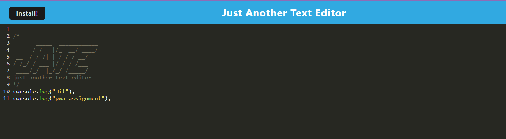

## Progressive Web Applications(PWA) Text Editor
Develop a resilient browser-based text editor that meets PWA criteria, functioning seamlessly online and offline. This single-page application uses IndexedDB for robust data storage with the idb package, allowing developers to create and manage notes or code snippets without an internet connection. Featuring service worker integration and modern web technologies, the editor ensures data is secure and accessible. Deployed on Render, it highlights efficient web development practices with a focus on usability and reliability.  
    

## Render link 
https://text-editor-84ow.onrender.com/   

## Technologies Used
React 
Progressive Web Application (PWA) Technologies 
IndexedDB 
Node.js 
Render 
GitHub 
JavaScript 
Express.js  

## Commands to run the application
npm i && npm run build  
npm run start  
